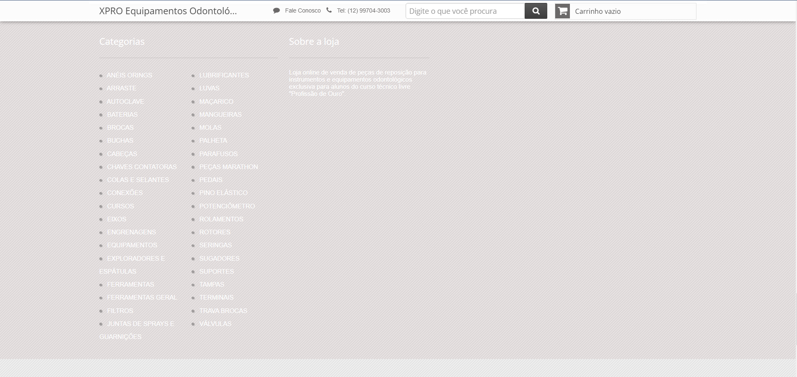
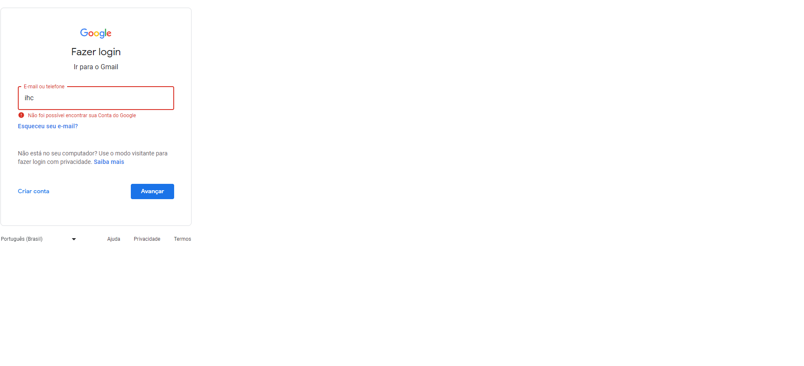
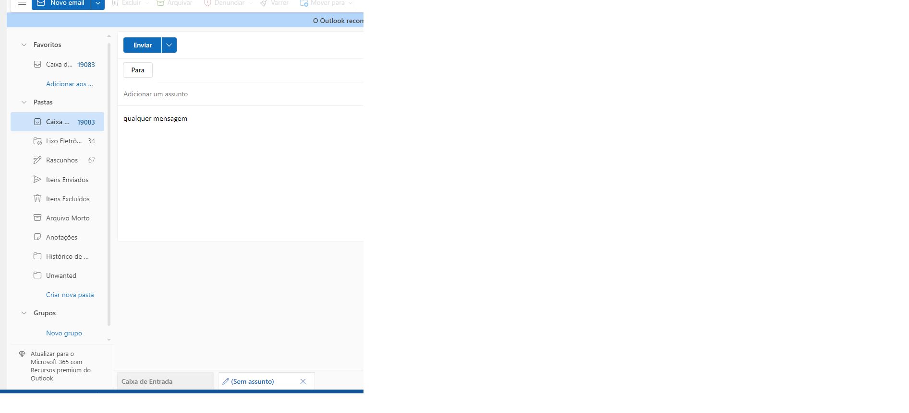
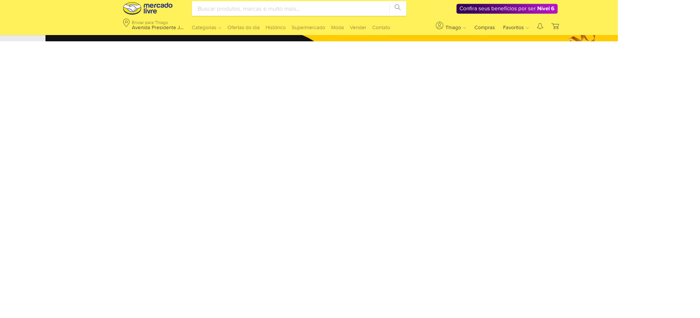
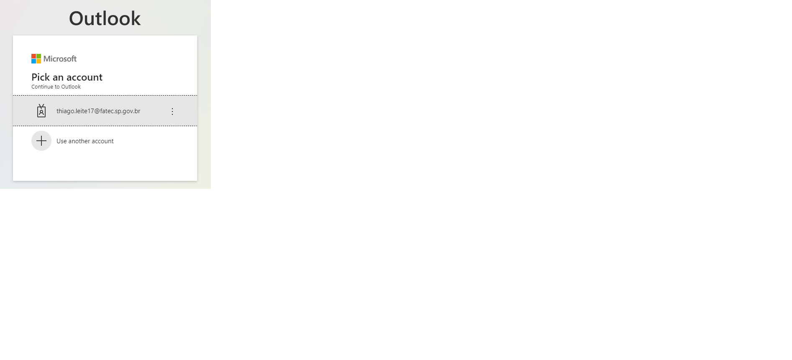
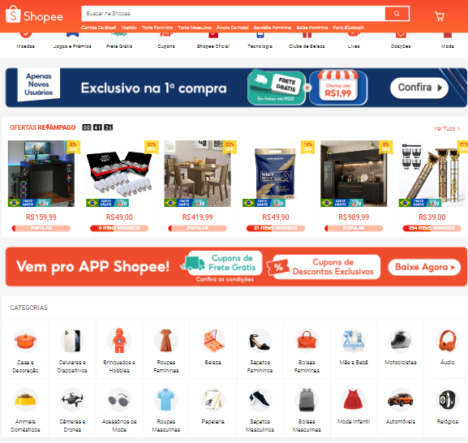
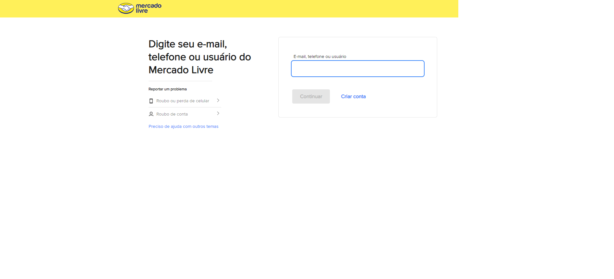
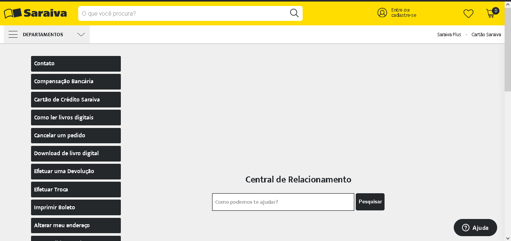

## 10 heurísticas de usabilidade de Nielsen

 1 - Visibilidade do Status do sistema 

  

    
 Exemplo Positivo 

    Consigo visualizar em qual momento estou no vídeo e também os vídeos que já vi.
     
    
     
  

  
  

  
 Exemplo Negativo 

    A cor de fundo dificulta muita visualização do site.
     
    
     
  

 2 - Correspondência entre o sistema e o mundo real 

  

    
 Exemplo Positivo 

    Alerta de erro sem uso de termos técnicos. Palavras de uso comum no dia a dia.
     
    
     
  

  
  

  
 Exemplo Negativo 

    Conteudo....
  

 3 - Controle e liberdade para o usuário 

  

    
 Exemplo Positivo 

    Ao escrever um email não preciso me preocupar em sair ou fechar a página, automaticamente salva em rascunho.
     
    
     
  

  
  

  
 Exemplo Negativo 

    Conteudo....
  

 4 - Consistência e Padronização 

  

    
 Exemplo Positivo 

    Uso do padrão dos ecomerces, barra superior com carrinho, perfil e logomarca.
     
    
     
    
  

  
  

  
 Exemplo Negativo 

    Conteudo....
  

 5 - Prevenção de erros 

  

    
 Exemplo Positivo 

    Não permite o envio de e-mail sem destinatário, evita um erro de uma mensagem ser perdida.
     
    
     
  

  
  

  
 Exemplo Negativo 

    Conteudo....
  

 6 - Reconhecimento em vez de memorização 

  
  

    
 Exemplo Positivo 

    Reconhece o meu computador e guarda o meu login, facilitando o acesso e evitando a memorização.
     
    
     
  

  
  

  
 Exemplo Negativo 

    Conteudo....
  

 7 - Eficiência e flexibilidade de uso 

  

    
 Exemplo Positivo 

    Uma aba só com atalhos para garantir maior eficiência e agilidade no uso do sistema.
     
    
     
  

  
  

  
 Exemplo Negativo 

    Conteudo....
  

 8 - Estética e design minimalista 

  

    
 Exemplo Positivo 

    Página bem harmônica e com a estética muito agradável.
     
    
     
  

  
  

  
 Exemplo Negativo 

    Página muito poluída.
     
    
     
  

 9 - Ajuda aos usuários a reconhecer, diagnosticar e recuperar erros 

  

    
 Exemplo Positivo 

    Ao tentar clicar no carrinho de compras sem estar logado, o sistema te direciona direto para o login, ajudando a reconhecer que ainda não está logado.
     
    
     
  

  
  

  
 Exemplo Negativo 

    Conteudo....
  

 10 - Ajuda e documentação 

  

    
 Exemplo Positivo 

    Uma boa página de ajuda.
     
    
     
  

  
  

  
 Exemplo Negativo 

    Conteudo....
  

